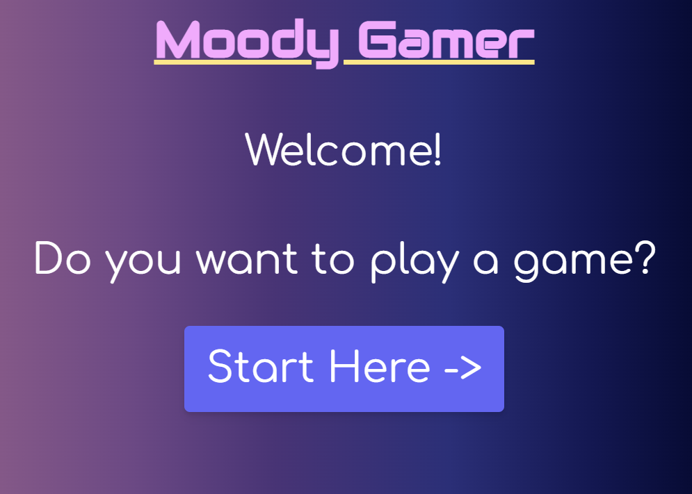
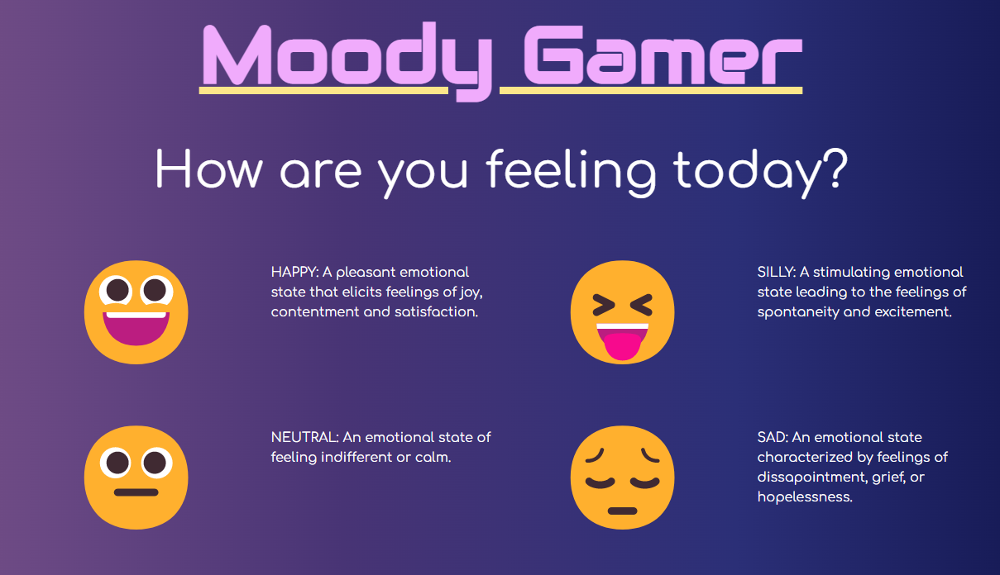
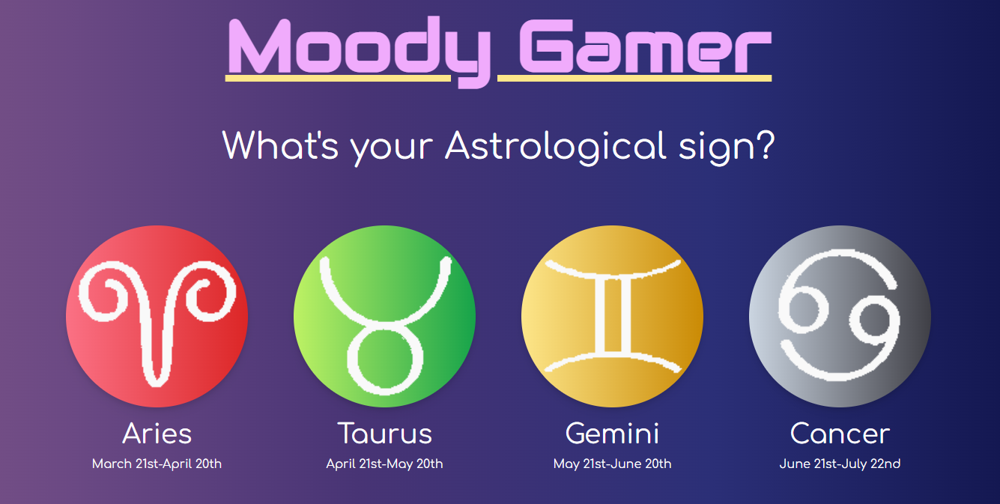

# moody-gamer

## Description

    This project is an app to suggest what games a user should play depending on astrological signs and their selected mood. We will implement an Aztro Astrology API and the RAWG video game API to get parameters for video game selection, while the user mood will be self-selected. 

## User Stories

    AS A Gamer,
    I WANT to know the daily horoscope
    SO THAT I can plan my gaming accordingly

    AS AN Indecisive Gamer,
    I WANT tailor my game selection to my mood and the current day's mood
    SO THAT I can be beat decision paralysis

    AS A Boot Camp Student,
    I WANT an application to recommend me a game
    SO THAT spend less time deciding and more time gaming (alongside studying)

    AS A Gaming Connoisseur,
    I WANT an application to classify my gaming tastes with certain astrological signs and moods
    SO THAT I understand my gaming tastes better

## Project Specifications

    GIVEN a page containing the horoscope and a selection of moods
    WHEN I select my astrological sign and my mood
    THEN I am given a horoscope and some game genre recommendations
    WHEN I click the game genre
    THEN I am given the top 10 game recommendations for the last week
    WHEN I enter tags, genres, and/or keywords into a search bar
    THEN I am given a list of recommended games

## Usage Instructions

    Upon loading the app, user is presented with a welcome page and a button saying "Start Here ->." Clicking that button will direct the user to a page that asks them to select their astrological sign. Hovering over any of the signs will add a border to the picture for additional button affordance. Selecting an astrological sign will direct the user to a page asking for their current mood. These six moods represent common moods adapted from 

## Screenshots

* Moody Gamer Front Page

* Mood Selection Page

* Astrological Sign Selection Page 

## Contributors

    Joshua Rae: https://github.com/joshuar2155

    Jake McMillan: https://github.com/jakewmcmillan

    Tabitha Spencer-Salmon: https://github.com/TabithaLy

    Voravich Silapachairueng: https://github.com/voravichs

## Credits

    Credit to https://emma.ca/zodiac-signs for the zodiac pictures.

    Credit to https://www.schemecolor.com/night-sky-color-palette.php for the background gradient.

    Credit to https://cssgradient.io/ for easy CSS gradient creation.

## Github Deployed Site Link and Repository Link

    GitHub Repository: https://github.com/voravichs/moody-gamer

    GitHub Pages Deployment: https://voravichs.github.io/moody-gamer/
